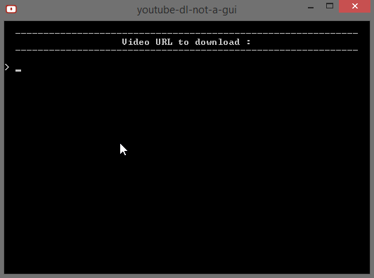

# youtube-dl-not-a-gui

## About
[KISS](https://en.wikipedia.org/wiki/KISS_principle) batch script to easily download videos from youtube.com or [other video platforms](http://rg3.github.io/youtube-dl/supportedsites.html) using [youtube-dl](https://github.com/rg3/youtube-dl) and [FFmpeg](https://www.ffmpeg.org/) with the best overall quality available. Don't want to deal with Command Line ? Well, you're in the right place !

## Usage

On Microsoft Windows, run `youtube-dl-not-a-gui.bat` or `youtube-dl-not-a-gui.exe`, input a video URL, and press `Enter`.  
You can also input multiple video, channel, or playlist URLs, space-separated.

By default, videos are downloaded in the `C:\Users\USERNAME\Videos\` folder.  
The `youtube-dl.exe` binary is automatically updated.  
Stable version of [FFmpeg](https://www.ffmpeg.org/) is built-in.

## Configuration
If you want to change the downloads folder location for example, simply edit the `youtube-dl-not-a-gui.bat` script from the root depository folder.  
  
If you want an .exe file (with a [handsome icon](ressources/icon/youtube-dl-not-a-gui.svg "youtube-dl-not-a-gui.svg")), edit the `youtube-dl-not-a-gui.bat` from `ressources` folder, and compile it with [Bat To Exe Converter](http://www.f2ko.de/en/b2e.php).

## Requirements
- Microsoft Windows

## License
youtube-dl-not-a-gui is released under the [Unlicense](http://unlicense.org).